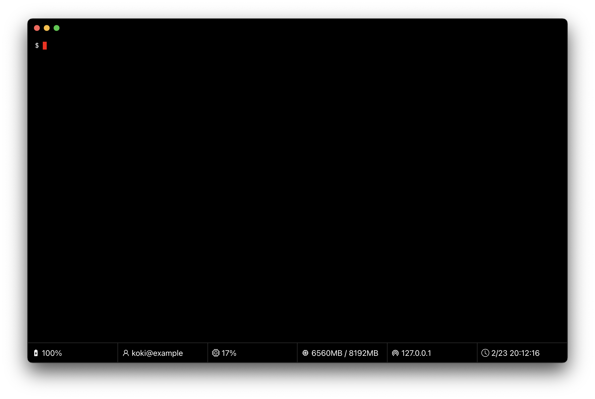

[](https://github.com/koki-develop/hyper-statusbar/actions/workflows/build.yml)
[](https://codeclimate.com/github/koki-develop/hyper-statusbar/maintainability)
[](./LICENSE)
[](https://twitter.com/koki_develop)

# Hyper Statusbar

Hyper Statusbar is a plugin for Hyper that displays a status bar.



# Installation

Hyper Statusbar can be cloned locally and used as a local plugin.  
( As I am developing it for my own use, I don't plan to release it as an npm package. )

First, clone this repository to `~/.hyper_plugins/local` and build it.

```
$ git clone git@github.com:koki-develop/hyper-statusbar.git ~/.hyper_plugins/local/hyper-statusbar
$ yarn --cwd ~/.hyper_plugins/local/hyper-statusbar install
$ yarn --cwd ~/.hyper_plugins/local/hyper-statusbar build
```

Then edit `~/.hyper.js` and add `"hyper-statusbar"` to `localPlugins`.

```js
// ~/.hyper.js
localPlugins: ["hyper-statusbar"],
```

# Configuration

You can specify which panel to display in the `config.statusbar.panels` in `~/.hyper.js`.

```js
// ~/.hyper.js
config: {
  statusbar: {
    panels: ["battery", "user", "cpu", "memory", "ip", "clock"],
  },
}
```

# LICENSE

[MIT](./LICENSE)
